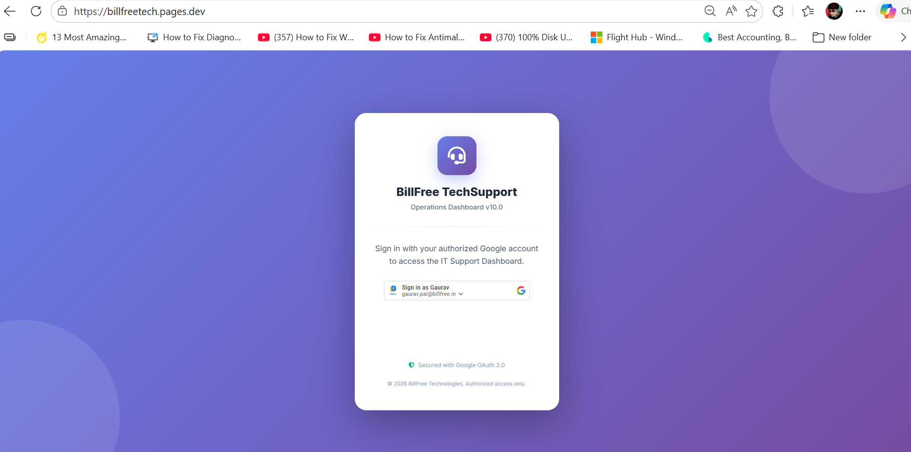
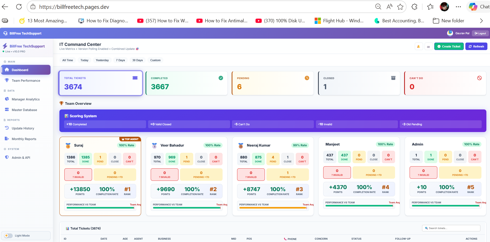
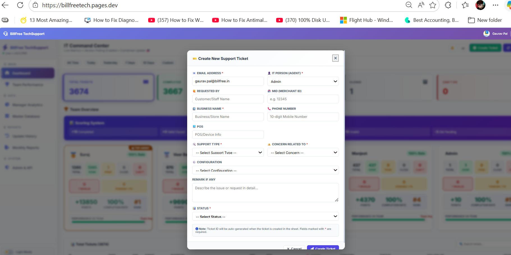
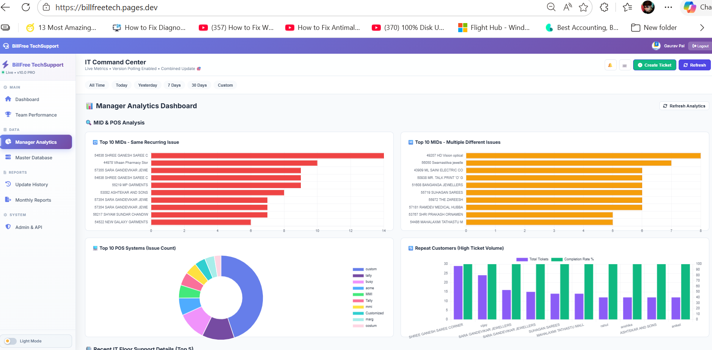

<div align="center">


# BillFree TechSupport Ops

### Production IT Support Ticketing System · Operations Dashboard v10.0 PRO

[](https://billfreetech.pages.dev)
[](#changelog)
[](#architecture)
[](https://billfreetech.pages.dev)
[](#live-agent-stats)
[](#security)

<br/>

> **A production IT support operations platform** built entirely on Google Apps Script + Google Sheets.
> Serving a live fintech POS support team — managing **3,674+ tickets**, **5 agents**,
> real-time KPIs, gamified performance scoring, manager analytics, and monthly reporting.
> Includes a WhatsApp bot REST API, a public QuickFix portal for merchants,
> and a separate cross-functional staff portal for internal teams.

<br/>

[🌐 Live Dashboard](https://billfreetech.pages.dev) &nbsp;·&nbsp;
[📖 API Docs](./API_DOCUMENTATION.md) &nbsp;·&nbsp;
[🎫 QuickFix Portal](#-portals--urls) &nbsp;·&nbsp;
[🏢 CF Staff Portal](#-portals--urls) &nbsp;·&nbsp;
[🚀 Deploy Guide](#-deployment-guide)

</div>

---

## 📸 Screenshots

<table>
  <tr>
    <td align="center" width="50%"><b>🔐 Google OAuth Login</b></td>
    <td align="center" width="50%"><b>📊 IT Command Center — Live Dashboard</b></td>
  </tr>
  <tr>
    <td></td>
    <td></td>
  </tr>
  <tr>
    <td align="center"><b>➕ Create New Support Ticket</b></td>
    <td align="center"><b>📈 Manager Analytics Dashboard</b></td>
  </tr>
  <tr>
    <td></td>
    <td></td>
  </tr>
</table>

<div align="center">

🔗 **Live at** → [https://billfreetech.pages.dev](https://billfreetech.pages.dev) · Sign in with authorized `@billfree.in` Google account

</div>

---

## 🔍 What Is This?

**BillFree TechSupport Ops** is a production-grade IT helpdesk and operations management system built without any traditional server infrastructure. It runs entirely on **Google Apps Script** (backend) and **Cloudflare Pages** (frontend), using **Google Sheets** as the database.

Built to replace manual WhatsApp ticket tracking and Excel-based reporting for a fintech company's merchant POS support team. Today it handles the **complete ticket lifecycle** — from creation (via dashboard, portal, or WhatsApp bot) to resolution, follow-up, reporting, and performance scoring.

### 📊 At a Glance

| Metric | Value |
|:---|:---|
| 🎫 Total Tickets in Production | **12000+** |
| 👥 Active Support Agents | **5** |
| 🏢 Cross-Functional Teams Served | Ops, Finance, HR, Accounts |
| ⚡ Dashboard Initial Load | **~2–3 seconds** (chunked cache) |
| 🔍 Ticket Search Response | **< 300ms** |
| 🔄 Data Sync Interval | **30 seconds** (version-based polling) |
| 🛡️ Authentication | Google OAuth 2.0 + HMAC tokens |
| 📅 In Production Since | **2025** |
| 🏗️ Built With | Google Apps Script · Google Sheets · Cloudflare Pages · Vanilla JS |

---

## ✨ Full Feature Breakdown

### 📊 1. IT Command Center — Live Dashboard

The main operations hub for IT agents. Secured behind Google OAuth — only pre-authorized `@billfree.in` accounts can access it.

- **Real-time KPI cards** — Total Tickets · Completed · Pending · Closed · Can't Do — each clickable to filter the ticket table
- **Time range filters** — All Time · Today · Yesterday · Last 7 Days · Last 30 Days · Custom Date Range
- **Master ticket table** — fully searchable, sortable by any column, with inline status update
- **Follow-up conversation thread** per ticket — complete audit trail of every agent interaction
- **Version-based polling** — checks for backend changes every 30 seconds; only re-fetches data when the version stamp changes
- **Chunked caching** — ticket data split into 100KB chunks, version-stamped, gives sub-3-second loads on 3,674+ rows

---

### ➕ 2. Ticket Creation — Agent Modal

- **Fields:** Agent Email (auto-filled) · IT Person · Requested By · MID · Business Name · POS Device · Support Type · Concern · Configuration · Remark · Status
- **Auto-assignment** — picks agent with lowest open ticket count at time of creation
- **CSRF token** — every session gets a unique token; all writes validated server-side
- **Globally sequential Ticket IDs** — format `BF-TKT-YYYY-MM-NNNN`, counter never resets

---

### 🏆 3. Team Performance & Gamified Scoring

| Action | Points |
|:---|:---:|
| ✅ Ticket Completed | **+10** |
| 🔒 Valid Closed | **+0** |
| ❌ Can't Do | **-5** |
| 🚫 Invalid Ticket | **-10** |
| ⏳ Pending > 7 Days | **-3** |

**Per-Agent Card shows:** Total · Done · Pending · Closed · Can't Do · Invalid · Pending >7d SLA flag · Points · Completion Rate · Rank · Performance vs Team Average bar · 🥇 TOP AGENT badge

---

### 📊 4. Manager Analytics Dashboard

| Chart | What It Reveals |
|:---|:---|
| 🔴 **Top 10 MIDs — Same Recurring Issue** | Merchants with repeated identical problems |
| 🟠 **Top 10 MIDs — Multiple Different Issues** | Merchants experiencing diverse failure patterns |
| 🍩 **Top 10 POS Systems by Issue Count** | Which POS device models generate most tickets |
| 📊 **Repeat Customers — High Ticket Volume** | Bar + completion rate overlay |

---

### 📅 5. Monthly Reports

- Auto-aggregated monthly summary per agent for any selected month
- Breakdown by status, support type, and agent
- Management-ready format for operational review

---

### 🏢 6. Cross-Functional (CF) Staff Portal

A **dedicated URL** for internal teams — **no login required**, fully mobile-responsive.

**URL:** `https://script.google.com/.../exec?page=cf-portal`

| Tab | Purpose | Key Fields |
|:---|:---|:---|
| 📝 **Raise Ticket** | Submit an IT issue | Name · Dept · Priority · Concern · Location · Asset ID · Phone |
| 🔍 **Track Status** | Check ticket by ID | Only IT Floor Support tickets returned — customer data hidden |
| 💡 **Common Issues** | Self-help guide | Network · Printer · Tally ERP · Slow PC |

Auto-tagged remark: `CF-Portal | Dept: X | Raised by: Y | Priority: Z` · Support Type = `IT Floor Support`

---

### 🤖 7. WhatsApp Bot API

```http
POST https://script.google.com/macros/s/{DEPLOYMENT_ID}/exec
Content-Type: application/json
```

```json
{
  "action": "createticket",
  "apiKey": "YOUR_API_KEY",
  "concern": "POS not printing receipts",
  "mid": "123456",
  "business": "ABC Garments",
  "phone": "9876543210"
}
```

**Response:**
```json
{
  "success": true,
  "ticketId": "BF-TKT-2026-05-2527",
  "assignedAgent": "Suraj",
  "status": "Not Completed",
  "requestId": "LK3F8A2B-X9QR"
}
```

| Code | Cause | Action |
|:---|:---|:---|
| `E001` | Rate limit / duplicate | Wait 60s |
| `E002` | Invalid API key | Fix key |
| `E004` | Missing field / bad MID | Fix payload |
| `E005` | DB unavailable | Retry 10s |
| `E006` | Server busy | Retry 5s |
| `E999` | Internal error | Contact support |

> 📖 Full reference → **[API_DOCUMENTATION.md](./API_DOCUMENTATION.md)**

---

## 🌐 Portals & URLs

| Portal | URL Pattern | Users | Auth |
|:---|:---|:---|:---|
| 🖥️ **Agent Dashboard** | `https://billfreetech.pages.dev` | IT Agents & Admin | ✅ Google OAuth |
| 🔧 **QuickFix Portal** | `...exec?page=portal` | Customers & Merchants | ❌ Public |
| 🏢 **CF Staff Portal** | `...exec?page=cf-portal` | Ops · Finance · HR · Accounts | ❌ Public |
| 🤖 **WhatsApp API** | `POST ...exec` | Bot integrations | 🔑 API Key |

---

## 🛠️ Deployment Guide

### 📋 Prerequisites
- A Google Sheet named **"IT Tracker 26"**.
- Columns set up as: `Ticket ID (A)`, `Created At (B)`, `Agent Email (C)`, `IT Email (D)`, `Requested By (E)`, `MID (F)`, `Business (G)`, `POS (H)`, `Support Type (I)`, `Concern (J)`, `Config Notes (K)`, `Remark (L)`, `Status (M)`, `Reason (N)`, `Phone (O)`.

### 1. Google Apps Script (Backend)
1. Create a new Google Apps Script project.
2. Copy the content of `Code.gs` into the editor.
3. If serving via GAS, add `TicketPortal.html` as an HTML file.
4. Deploy as a **Web App**:
   - Execute as: **Me**
   - Who has access: **Anyone**
5. Copy the **Web App URL**.

### 2. Cloudflare Pages (Frontend)
1. Open `Index.html`.
2. Update the `GAS_ENDPOINT` constant (around line 640) with your **Web App URL** from Step 1.
3. Push this repository to GitHub.
4. Connect the repository to **Cloudflare Pages**.
5. Set the build output directory to `/`.

---

## 🏗️ Architecture

The system follows a modern decoupled architecture:

1. **Frontend**: Standalone HTML5/JS/CSS application hosted on Cloudflare Pages. It uses the `fetch()` API to communicate with the GAS backend.
2. **Backend**: Google Apps Script acting as a REST API. It handles authentication, validation, and database operations.
3. **Database**: Google Sheets for low-cost, real-time data persistence.
4. **Caching**: Uses `CacheService` and browser `localStorage` for high-speed data retrieval.

---

Built with ❤️ for the BillFree Support Team.
